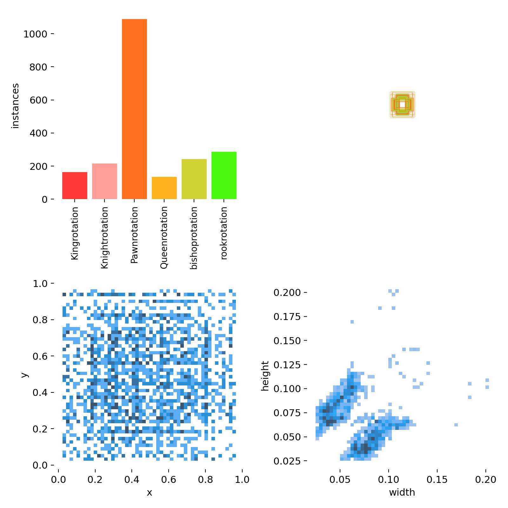
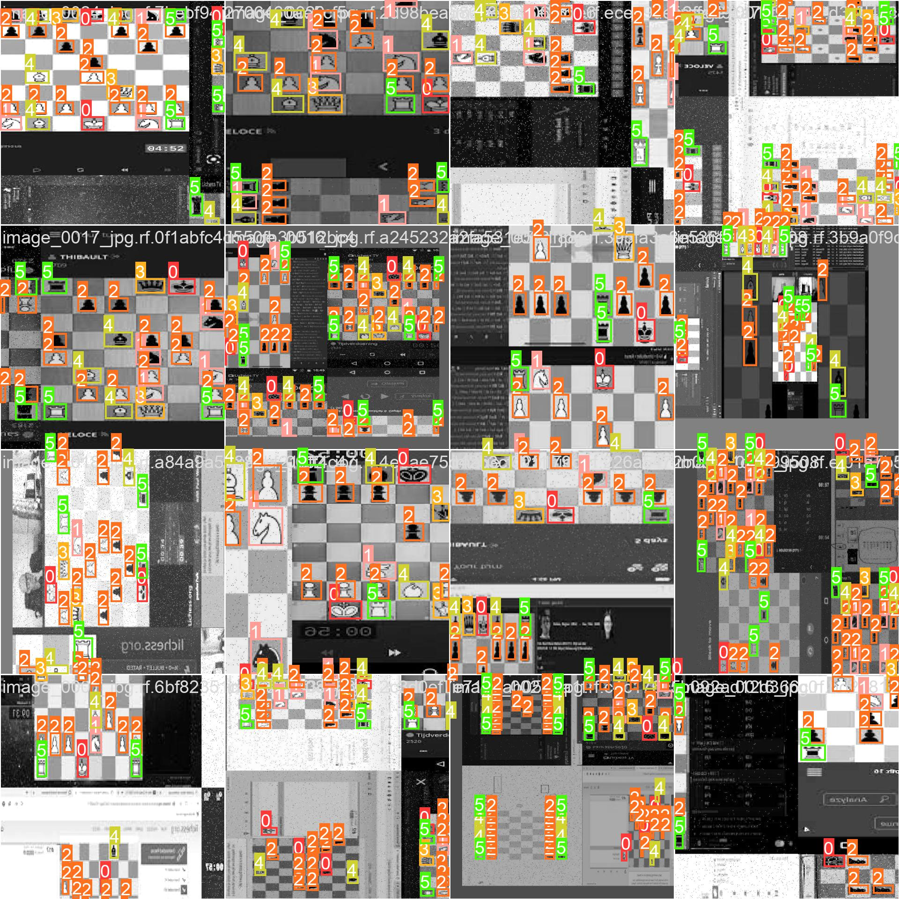
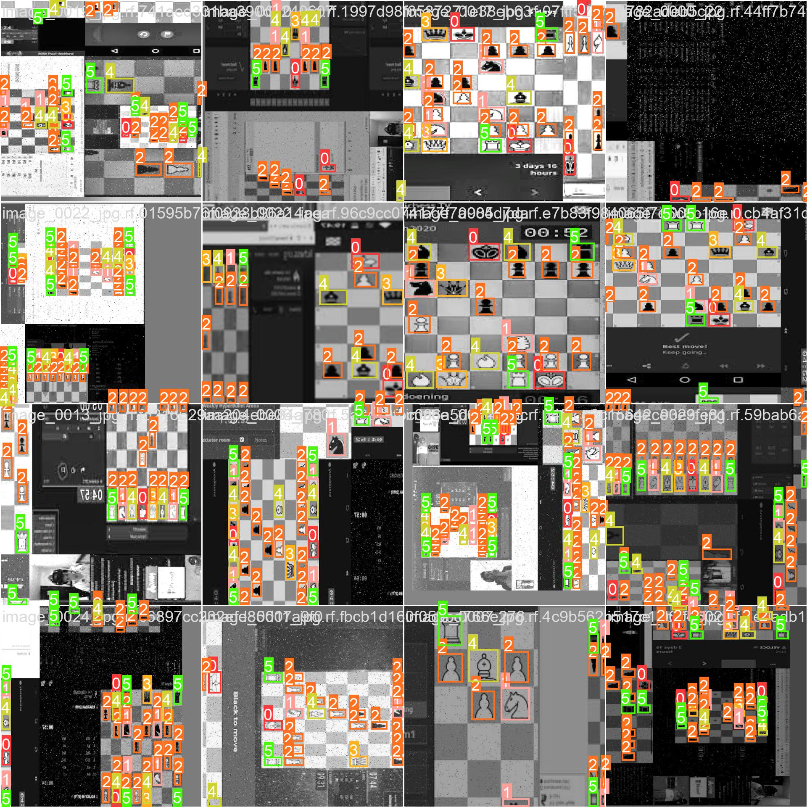
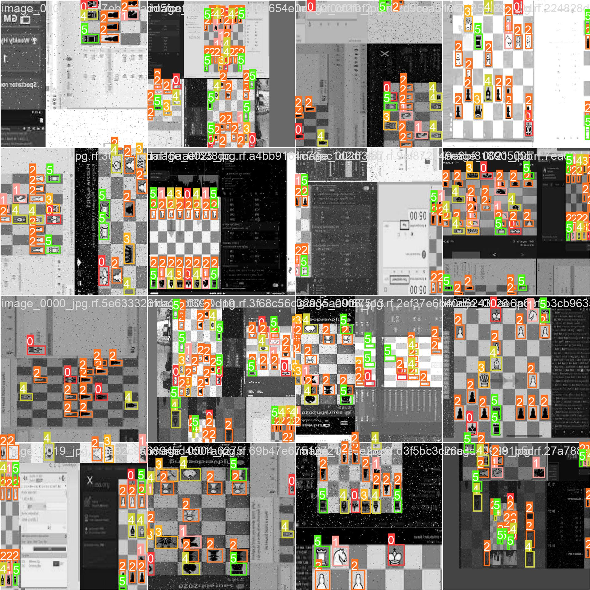
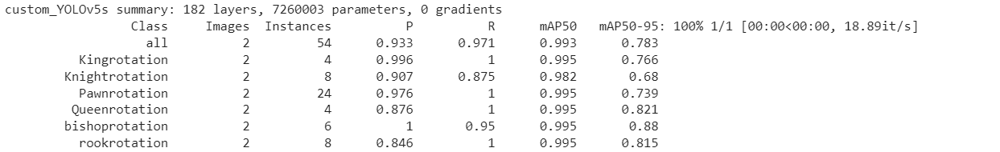
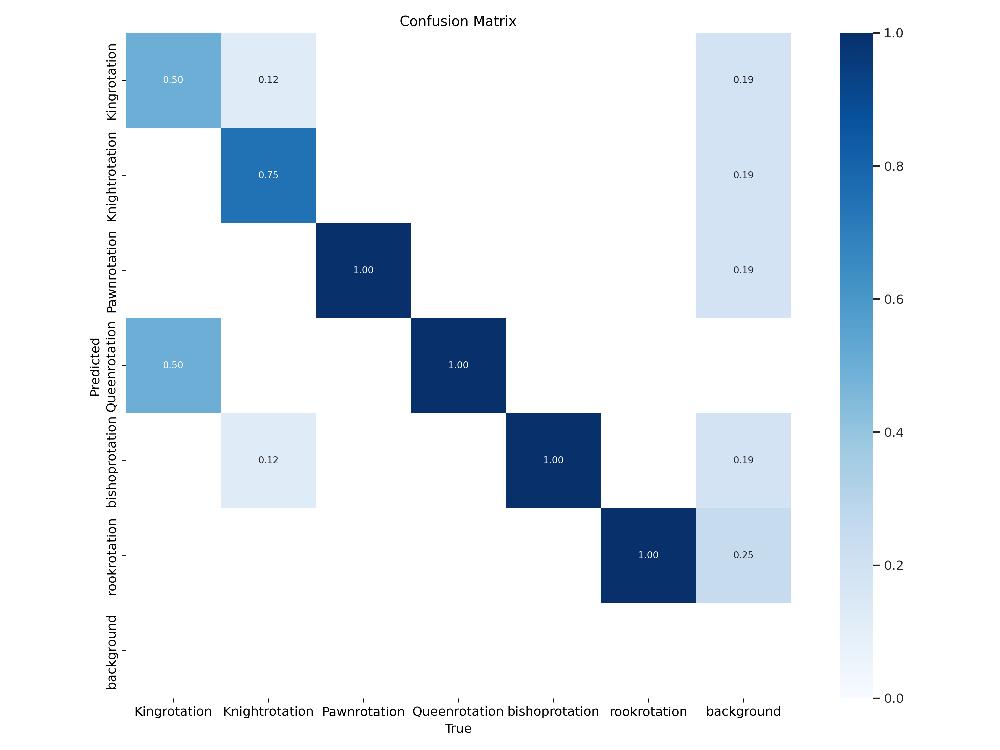
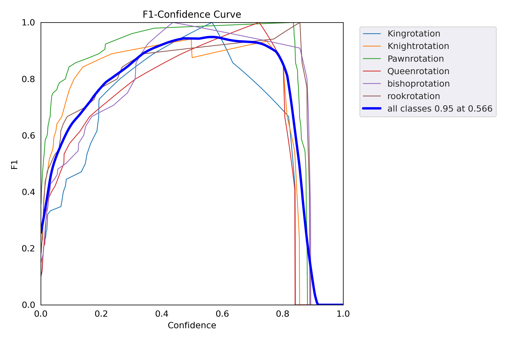
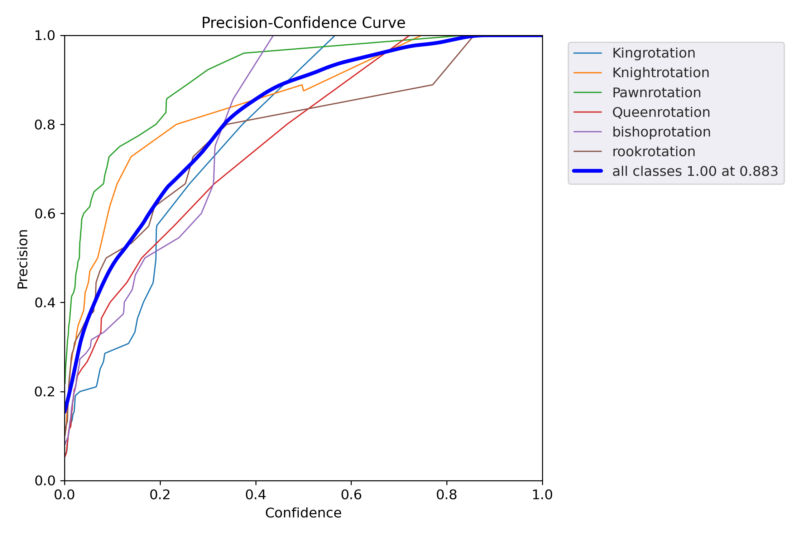
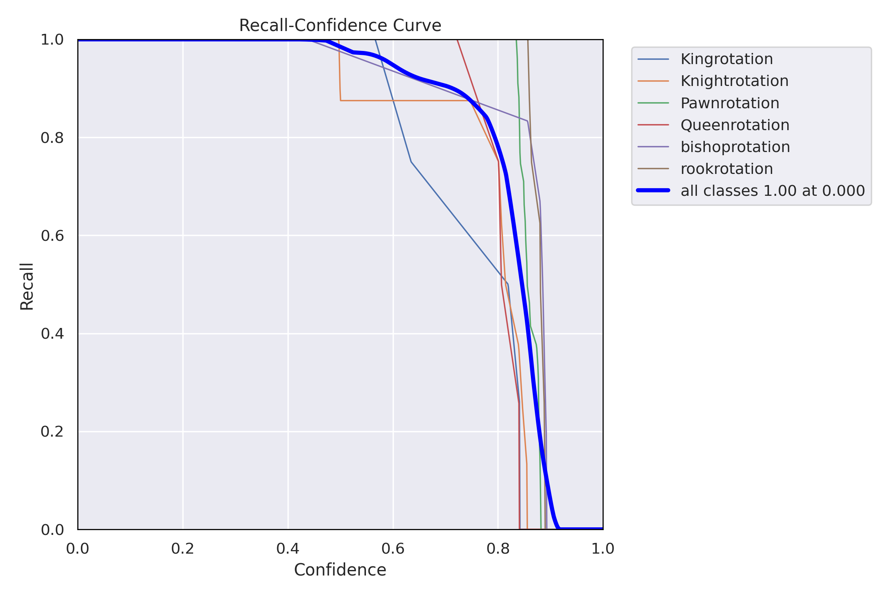
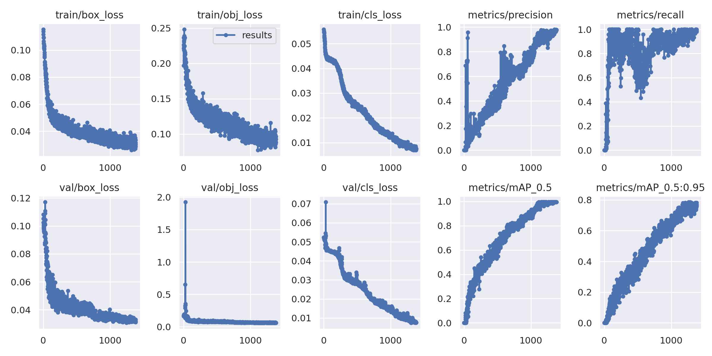

# YOLO_ChessMaster

> Ever played chess?? Do you have any idea what [lichess](https://lichess.org/) is?  
> Well its a platform where chess lovers from any part of the world meet and compete among them. Interesting enough??

Here is a **computer vision project** related to something on that platform.
This has been made using **python** with the help of **YoloV5**. Tried out Yolov4 but took many hours of training so shifted to Yolov5 :(

The project includes:
- **Collecting snapshots** from Lichess, **annotating it** and making a **dataset out of in YAML format** for Yolo to understand.
- **Training the computer vision model** with the annotated images so that it can learn about the **features and edges**.
-** Testing and storing the weight **of the trained model for future use (If weights are not stored, then training it again will take 2 hours)

> How was the training process? How many images was it trained on?  
 Well, the model was trained for **6 different classes** (King, Queen, Pawn, Knight, Rook, Bishop). The number of instances of each class is in the image below.

The images of training were resized to **640*640** and **data augmentation** was performed on the training dataset before training. The **batch size was 16** for 1 epoch and the model was trained for **1381 epochs**.
Training batch snapshots:

> So, what are the final outcomes?  
> The model can identify any chess piece and name it accordingly whether it is a king, queen, bishop, knight, pawn, or rook. It is working on images in any format as of now but can be implemented in real-time as well.

> What about the "Performance of model"?  
> The model has **excellent performance** (literally more than what I thought). The overall **mAP(mean Average Precision) of the model is 99.30%** with **precision and recall as 0.933 and 0.971** respectively. Going with the statement "picture speaks more than words" adding a few snapshots:

